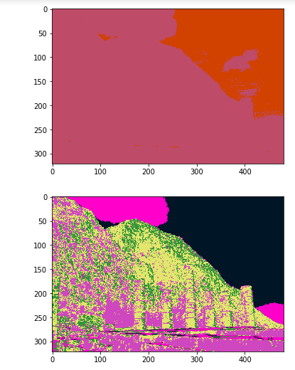
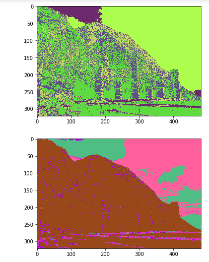
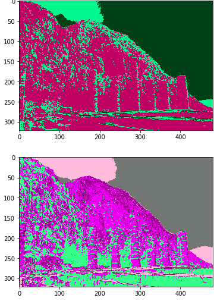
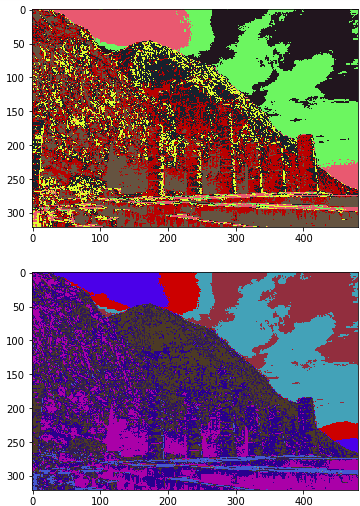
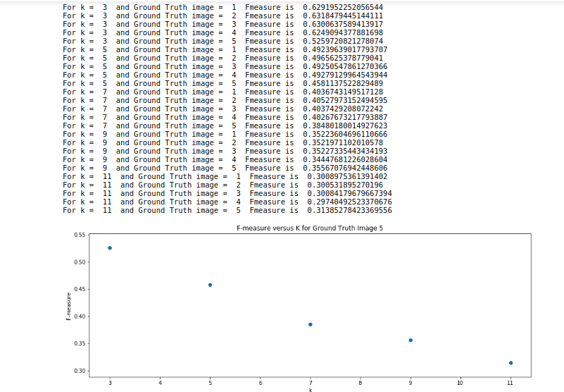
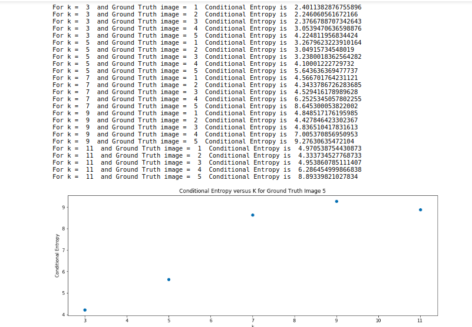
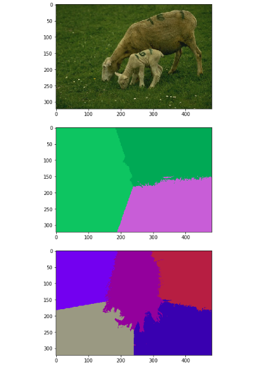

# Pattern Recognition Course Assignment 2: Image Segmentation
### Authors: Amr Elzawawy & Omar Swidan at March 2019

Introduction
============

What is Image Segmentation ?
----------------------------

Image segmentation is the process of partitioning a digital image into
multiple segments (sets of pixels, also known as super-pixels). The goal
of segmentation is to simplify and/or change the representation of an
image into something that is more meaningful and easier to analyze.\
Image segmentation is typically used to locate objects and boundaries
(lines, curves, etc.) in images. More precisely, image segmentation is
the process of assigning a label to every pixel in an image such that
pixels with the same label share certain characteristics. The result of
image segmentation is a set of segments that collectively cover the
entire image, or a set of contours extracted from the image.Each of the
pixels in a region are similar with respect to some characteristic or
computed property, such as color, intensity, or texture. Adjacent
regions are significantly different with respect to the same
characteristic(s).

Applications of Image Segmentation.
-----------------------------------

Some of the practical applications of image segmentation are:
1. Content-based image retrieval.
2. Machine vision.
3. Medical imaging,including volume rendered images from computed
tomography and magnetic resonance imaging.
4. Object detection.(Pedestrian detection,Face detection,Brake light
detection, Locate objects in satellite images)
5. Recognition Tasks. (Face recognition, Fingerprint recognition, Iris
recognition)
6. Traffic control systems.
7. Video surveillance.
8. Video Object Co-segmentation and action localization.
9. Community detection in social network analytic of social network
graphs.

Segmentation using K-means algorithms
=====================================

Several general-purpose algorithms and techniques have been developed
for image segmentation. To be useful, these techniques must typically be
combined with a domain’s specific knowledge in order to effectively
solve the domain’s segmentation problems.
One of those algorithms is the K-means algorithm is an iterative
technique that is used to partition an image into K clusters.
K-means clustering is a method of vector quantization, originally from
signal processing, that is popular for cluster analysis in data mining.
k-means clustering aims to partition n observations into k clusters in
which each observation belongs to the cluster with the nearest mean,
serving as a prototype of the cluster. The problem is computationally
difficult (NP-hard); however, efficient heuristic algorithms converge
quickly to a local optimum.
The term “k-means” was first used by James MacQueen in 1967,[1] though
the idea goes back to Hugo Steinhaus in 1957.[2]

Algorithm
---------

K-means algorithm steps and procedure is provided in Figure 1 which is
taken from [3] from Chapter 13.

The steps is as follows, First we Pick K cluster centers, either
randomly or based on some heuristic method.Secondly, we assign each
pixel in the image to the cluster that minimizes the distance between
the pixel and the cluster center.Then, we re-compute the cluster centers
by averaging all of the pixels in the cluster.
Finally, we repeat steps 2 and 3 until convergence is attained (i.e. no
pixels change clusters) In this case, distance is the squared or
absolute difference between a pixel and a cluster center. The difference
is typically based on pixel color, intensity, texture, and location, or
a weighted combination of these factors. K can be selected manually,
randomly, or by a heuristic. This algorithm is guaranteed to converge,
but it may not return the optimal solution. The quality of the solution
depends on the initial set of clusters and the value of K. And
convergence is either when the centroids have stabilized, meaning that
there is no change in their values because the clustering has been
successful or the defined number of iterations has been achieved.

Implementation and Results.
---------------------------

We implemented the above algorithm in Figure 1 using Python and Numpy
arrays. The code can be found in our github repo attached with this
report in file “clustering.py”. The results of our k-means
implementation on a selected image is displayed below in figures 3 and 4
under each k value from a range provided (3,5,7,9).

The results are imperfect and this is due to the random initialization
of the centroids at the start of the algorithm. We then experimented the
results using Sklearn’s k-means algorithm to obtain better results which
are displayed below in figures 5 and 6 under each k value from a range
provided (3,5,7,9).

As illustrated, the Kmeans algorithm from Sklearn out preforms our
implementation due to their usage of kmeans++ algorithm to initialize
the centroids instead of a completely random approach and that is why we
continue he project then using the Kmeans algorithm from Sklearn to
better capture and realize clustering details with future work goals to
implement k++ algorithm for centroid initialization.

Clustering Evaluation
---------------------

We evaluated the clustering using both F-measure and Conditional
Entropy. In statistical analysis of binary classification, the F1 score
(also F-score or F-measure) is a measure of a test’s accuracy. It
considers both the precision p and the recall r of the test to compute
the score: p is the number of correct positive results divided by the
number of all positive results returned by the classifier, and r is the
number of correct positive results divided by the number of all relevant
samples (all samples that should have been identified as positive). The
F1 score is the harmonic average of the precision and recall, where an
F1 score reaches its best value at 1 (perfect precision and recall) and
worst at 0. In information theory, the conditional entropy (or
equivocation) quantifies the amount of information needed to describe
the outcome of a random variable Y given that the value of another
random variable X is known. Here, information is measured in shannons,
nats, or hartleys.
Conditional entropy equals zero if and only if the value of Y is
completely determined by the value of X. The results of the same
selected image as above is shown below in figures 7,8 for k values
[3,5,7,9,11]{}.

It is obvious that with increasing K value against the same ground truth
image, the values of the measures computed by our methods increase in
case of Entropy and decreases in case of F-measure thus achieving the
concept that increasing K degrades performance and doesn’t add much in
some cases. Take in notice that when experimented on other photos
different results and conclusions can be acquired since each image is
it’s own feature space and different characteristics.

Segmentation using Spectral Clustering
======================================

So now we open our eyes to see the big picture of the story. There are 2
broad approaches for clustering:
1. Compactness: Points that lie close to each other fall in the same
cluster and are compact around the cluster center. The closeness can be
measured by the distance between the observations. E.g.: K-Means
Clustering
2. Connectivity: Points that are connected or immediately next to each
other are put in the same cluster. Even if the distance between 2 points
is less, if they are not connected, they are not clustered together.
Spectral clustering is a technique that follows this approach.

Spectral clustering has become increasingly popular due to its simple
implementation and promising performance in many graph-based clustering.
It can be solved efficiently by standard linear algebra software, and
very often outperforms traditional algorithms such as the k-means
algorithm.

Algorithm
---------

LDA algorithm steps and procedure is provided in Figure 10 which is
taken from [3] from Chapter 16.

{width="\textwidth"}

To perform a spectral clustering we need 3 main steps:
1.Create a similarity graph between our N objects to cluster.
2.Compute the first k eigenvectors of its Laplacian matrix to define a
feature vector for each object.
3.Run k-means on these features to separate objects into k classes.

Implementation and results
--------------------------

Again, we implemented the above algorithm in Figure 10 using Python and
Numpy arrays. For Step 1, computing the similarity graph we first create
an undirected graph G = (V, E) with vertex set V = [v1, v2, …, vn]{} =
1, 2, …, n observations in the data. This can be represented by an
adjacency matrix which has the similarity between each vertex as its
elements . To do this, we can either compute The ε-neighborhood graph,
KNN Graph or Fully connected graph. ( More details on each of them can
be found in \[4\]) The problem in the implementation of Spectral
Clustering is that we have to store the nearest neighbour hood graph in
memory which is so huge and we don’t actually have enough RAM for such
an operation.So we experimented three implementation approaches to find
the best one and learn how to deal with such situation.

Beating the memory limits: Re-sizing the image
----------------------------------------------

An easy approach is to re-size the image enough (we chose 25 percent of
the image to keep) such that the NN graph can be constructed and reside
in memory resources that we are limited with. So for this approach we
tried two different ways one is to pass the re-sized image into our own
Spectral clustering algorithm implementation and the other way to pass
it into Sklearn Spectral Clustering implementation of the algorithm. We
only tried for k=5, and in that case our implementation actually was
better for that specific image we tested upon but still both was not
good enough. We figure that choosing another picture can be actually
obtain better results but leave it as a future work on the project. The
results of this approach is shown in figure 11 below.

{width="0.3\linewidth"}

{width="0.3\linewidth"}

Beating the memory limits: Annoy and Sparsity
---------------------------------------------

The second we approach is more complex and less intuitive, though it
also it didn’t give best or even better results but we intend to study
more about it and make it work better as our main goal in the future
work.
Annoy [6] "Approximate Nearest Neighbors Oh Yeah" is a C++ library with
Python bindings to search for points in space that are close to a given
query point. It also creates large read-only file-based data structures
that are mapped into memory so that many processes may share the same
data.
Annoy has the ability to use static files as indexes. In particular,
this means you can share index across processes. Annoy also decouples
creating indexes from loading them, so you can pass around indexes as
files and map them into memory quickly. Another nice thing of Annoy is
that it tries to minimize memory footprint so the indexes are quite
small. Why is this useful? If you want to find nearest neighbors and you
have many CPU’s, you only need to build the index once. You can also
pass around and distribute static files to use in production
environment, in Hadoop jobs, etc. Any process will be able to load
(mmap) the index into memory and will be able to do lookups immediately.
More details on how it works can be found in the documentation and
source code in [6]. We used annoy to store our NN graph efficiently
without re-sizing the image and then we used Sparse matrices to code up
our way through the Spectral clustering algorithm where we used
everything as sparse matrices as we noticed the obvious sparsity of our
data (only 5 non-zero values in each row of the image) and then we run
our algorithm accordingly. The results of this approach is found below
in figure 12 below.

{width="20.00000%"}

Adding spices to the mix: Spatial Feature encoding in KMeans
============================================================

In the previous parts, we used the color features RGB. We didn’t encode
the layout of the pixels. We want to modify that for K-means clustering
to encode the spatial layout of the pixels.
The spatial layout of a pixel means it’s location or coordinate in the
data matrix you are passing to the KMeans algorithm. Our Implementation
to this added feature is that we concatenated to our original data
matrix with three features (R,G,B), two more features one for the
x-coordinate and one for the y-coordinate of the location of the pixel
in the matrix where each row represents a pixel.
The conventional K-means approaches only involves the segmentation in
feature space. Without consideration of spatial constrains, and often
generate over segmented results. In [5], they proposed a novel K-means
based approach that combines spatial constrains. Much more details,
mathematical background and results on the process can be found there.
Our results of the implementation to such additive feature is shown
below in figure 13.

{width="60.00000%"}

Future Improvements and Goals
=============================

In this section we would like to point out some final notes that we
would like to do futuristic improvements in our source code and
implementation.
1- Adding kmeans++ algorithm for centroid initialization in our KMeans
algorithm implementation.
2- Further improve our spectral clustering algorithm implementation by
better understanding Annoy and the usage of sparse matrices
efficiently.
3-Answering of the following questions in mind and developing a
conclusion section to this document upon.
- Is KMeans training algorithm on a train set ? Does it differ to input
the whole training set or one image only ?
- Does Spectral clustering work good only in case of bad results in
KMeans and otherwise since data is already in good dimension
representation so it doesn’t add anything maybe turns it worse ?
- What did the spatial layout encoding add exactly to our clustering ?
How is the output obtained beneficial ?
- How can i (if at all) use my test and validation data split ? Don’t i
just need my train set ?

References
==========

**[1]** MacQueen, J. B. (1967). Some Methods for classification and
Analysis of Multivariate Observations. Proceedings of 5th Berkeley
Symposium on Mathematical Statistics and Probability. 1. University of
California Press. pp. 281–297. MR 0214227. Zbl 0214.46201. Retrieved
2009-04-07.

**[2]** Steinhaus, H. (1957). “Sur la division des corps matériels en
parties”. Bull. Acad. Polon. Sci. (in French). 4 (12): 801–804. MR
0090073. Zbl 0079.16403.

**[3]** DATA MINING AND ANALYSIS,Fundamental Concepts and Algorithms
MOHAMMED J. ZAKI Rensselaer Polytechnic Institute, Troy, New York WAGNER
MEIRA JR. Universidade Federal de Minas Gerais, Brazil

**[4]** [Spectral clustering: The intuition and math behind how it
works! -Neerja
Doshi](https://towardsdatascience.com/spectral-clustering-82d3cff3d3b7)

**[5]** [A Spatial Constrained K-Means Approach to Image Segmentation-
Ming Luo, Yu-Fei Ma, Hong-Jiang
Zhang](https://pdfs.semanticscholar.org/80fc/7a7b493aee50f0d32b6d271fe5b0ddb298fb.pdf)

**[6]** [Annoy open source library
repository](https://github.com/spotify/annoy)

